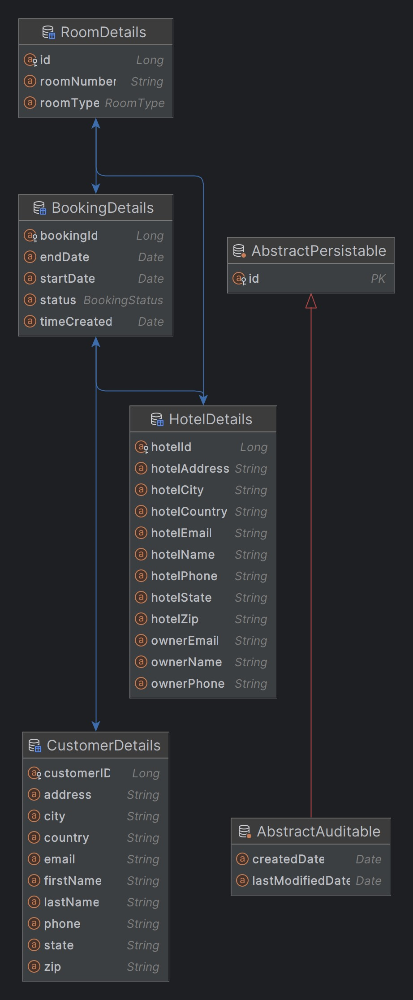

# HotelReservationAPI
Hotel Reservation API Demo

Prerequisite:
- Java 11
- Postgres DB

Install: 
- Run `mvn clean install`
- In order to test the application, you would need to install Postgres SQL on your machine, 
then create `hotelreserve` schema.
- All the config for DB connection are located in `application.properties`, **feel free to adjust it to fit your local set up.**
- Uncomment this line in `application.properties`, Hibernate will create the tables in the schema for you to test out
`#spring.jpa.hibernate.ddl-auto=create`

Swagger-UI for API testing: http://localhost:8080/swagger-ui.html

Features for Booking:
- Search (done)
- Update (done)
- View (done)
- Cancel (done)
- Create (done)

Testing Happy Case Flow: Create User -> Create Hotel (Test data can be found under /resources/testData/addHotelData.txt) -> Create Booking

## Database Desgin

# Implementation:
## Booking 
`http://localhost:8080/booking/{endpoint_mapping}`
- Add new Booking (POST) : `/addBooking` 
  - @Param: BookingRequestDto
    - Example Input :
    `{
      "customerId": 1,
      "endDate": "2024-05-10",
      "hotelId": 1,
      "roomId": 1,
      "startDate": "2024-05-06"
      }`
- Fetch All Bookings in DB (GET): `/getAllBookings`
- Cancel Booking (POST) : `/cancelBooking` 
  - @Param: Long bookingId
- Get Booking By Customer ID (GET): `/getBookingByCustomerId` 
  - @Param: Long customerId
- Get Booking By Booking ID (GET): `/getBookingById` 
  - @Param: Long bookingId
- Update existing booking information (POST) : `/updateBooking` 
  - @Param: 
    - Long bookingId
    - String newStartDate (YYYY-MM-DD)
    - String newEndDate (YYYY-MM-DD)
    - Long newRoomId 
- Search for available rooms for specific period of time for a hotel (GET): `/searchForBooking`
  - @Param:
    - Long hotelId
    - String startDate (YYYY-MM-DD)
    - String endDate (YYYY-MM-DD)

## Customer
`http://localhost:8080/v2/api/customer/{endpoint_mapping}`
- Create a new customer (POST): `/create`
  - @Param:
    - String firstName
    - String lastName
    - String email
    - String phone
    - String address
    - String city
    - String state
    - String zip
    - String country
- Get All Customer (GET) : `/getAllCustomer`
- Get Customer by customer ID: `/getCustomerById`
  - @Param:
    - Long id
## Hotel
`http://localhost:8080/hotel/{endpoint_mapping}`

- Create new Hotel (POST): `/create`
  - @Param : HotelRequestDto
  - Example Input: 
  - `{
    "hotelName": "Ceraton3",
    "hotelAddress": "Ceraton3",
    "hotelCity": "Ceraton3",
    "hotelState": "Ceraton3",
    "hotelCountry": "Ceraton3",
    "hotelZip": "Ceraton3",
    "hotelPhone": "1232132132",
    "hotelEmail": "Ceraton3@gmail.com",
    "ownerName": "Ceraton3",
    "ownerPhone": "0909270898",
    "ownerEmail": "Ceraton3@gmail.com",
    "rooms": [
    {
    "roomNumber": "A01",
    "roomType": "SINGLE_BED"
    },
    {
    "roomNumber": "A02",
    "roomType": "SINGLE_BED"
    },
    {
    "roomNumber": "B0101",
    "roomType": "KING_SIZE"
    }
    ]
    }`
- Fetch All Hotel in DB (GET): `/getAllHotels`

